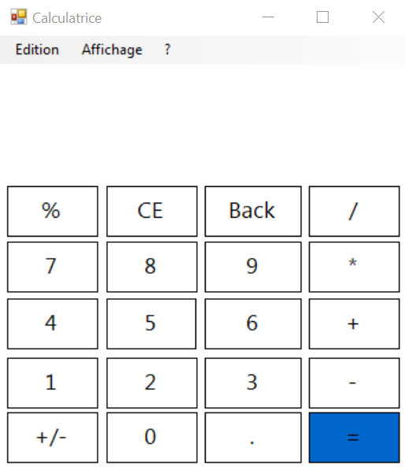

# Calculator

A simple calculator application developed in C#.

## Features

- Basic arithmetic operations: addition, subtraction, multiplication, and division.
- User-friendly interface for straightforward calculations.

## Getting Started

### Prerequisites

- [.NET SDK](https://dotnet.microsoft.com/download) installed on your machine.

### Installation

1. **Clone the repository:**

   ```bash
   git clone https://github.com/Harrakyass/Calculator.git
2.Navigate to the project directory:
  cd Calculator
Build and run the application:

    dotnet run


## Screenshot




Contributions are welcome! Please fork the repository and submit a pull request for any enhancements or bug fixes.
License

This project is licensed under the MIT License.


---

Feel free to customize this `README.md` further to better fit your project's specifics. If you need assistance with any particular section or additional features, don't hesitate to ask!
::contentReference[oaicite:0]{index=0}
 
